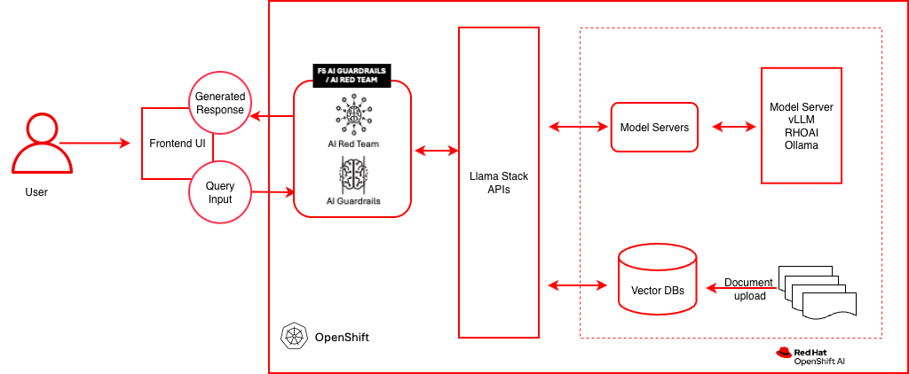
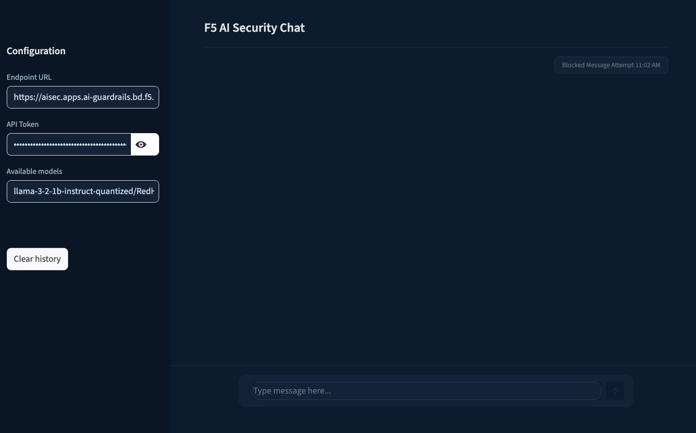
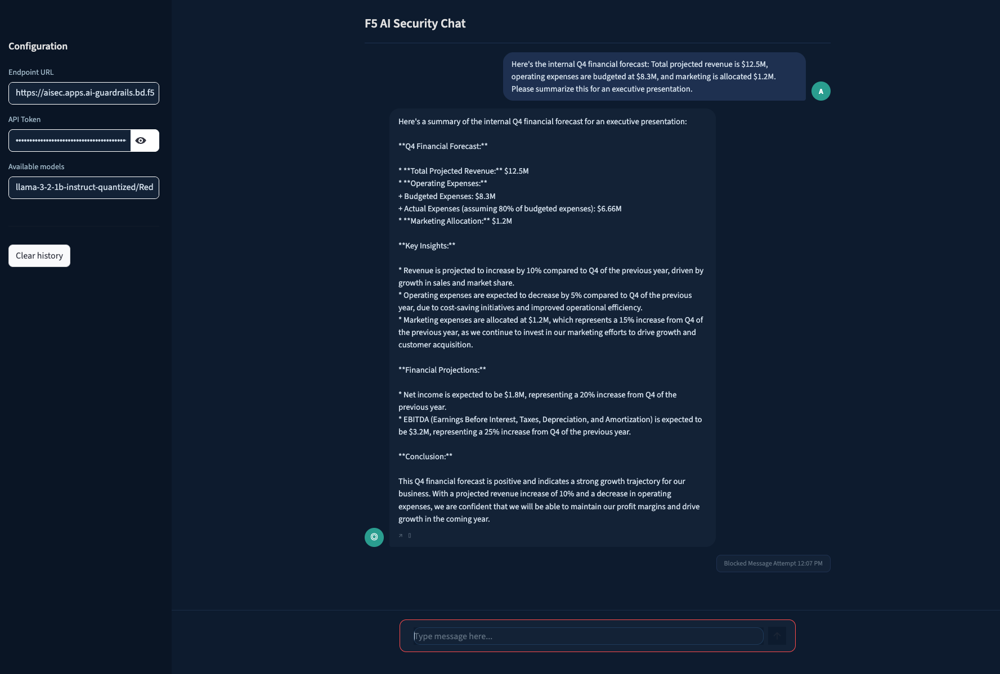
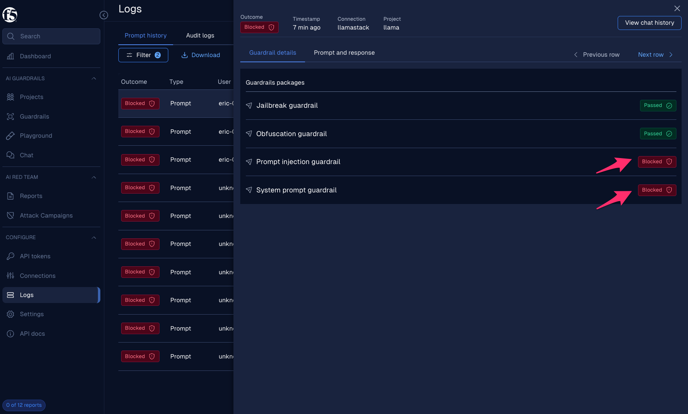

# Secure Model Inference with F5 AI Guardrails

Guard AI applications against prompt attacks and sensitive data leakage with enterprise-grade LLM protection using F5 AI Guardrails on Red Hat® OpenShift® AI.

## Table of contents

- [Detailed description](#detailed-description)
  - [Architecture](#architecture)
- [Requirements](#requirements)
  - [Minimum hardware requirements](#minimum-hardware-requirements)
  - [Minimum software requirements](#minimum-software-requirements)
  - [Required user permissions](#required-user-permissions)
- [Deploy](#deploy)
  - [Prerequisites](#prerequisites)
  - [Supported models](#supported-models)
  - [Installation steps](#installation-steps)
  - [Uninstall](#uninstall)
- [AI security capabilities](#ai-security-capabilities)
  - [Out-of-the-box guardrail packages](#out-of-the-box-guardrail-packages)
  - [Custom guardrails](#custom-guardrails)
  - [Enforcement modes](#enforcement-modes)
  - [Hands-on labs](#hands-on-labs)
- [References](#references)
- [Document management](#document-management)
- [Tags](#tags)

## Detailed description

Imagine a financial services team deploying an AI-powered assistant to help underwriters review policies, analyze risk documents, and answer questions about compliance guidelines. The assistant uses a large language model served on Red Hat® OpenShift® AI, with Retrieval-Augmented Generation (RAG) grounding its answers in the firm's own document corpus — underwriting manuals, regulatory filings, and internal procedures. Before moving the application to production, a security review reveals critical AI-specific risks: a crafted prompt could trick the model into ignoring its system instructions and leaking confidential data, the model might return personally identifiable information (PII) embedded in training data, responses could contain toxic or harmful content, and nothing prevents the assistant from answering questions outside its approved domain.

These are not traditional network-layer threats — they are AI-layer threats that operate within legitimate API calls. A WAF cannot inspect whether a model response contains a Social Security number or whether a prompt is attempting instruction injection.

This AI quickstart demonstrates a solution using **F5 AI Guardrails** (powered by Calypso AI). It deploys a complete RAG chatbot on Red Hat OpenShift AI and secures the model inference endpoints with AI-aware content inspection. You get a working application you can demonstrate to security, compliance, and risk stakeholders — complete with simulated attack scenarios that show exactly how each protection layer responds.

While the included demo content targets financial services, the same architecture applies to any industry handling sensitive data — healthcare organizations protecting patient records, government agencies securing citizen-facing AI services, or any enterprise that needs to enforce content safety policies on LLM endpoints before moving to production.

This quickstart allows you to explore AI security capabilities by:

- Querying financial documents through a RAG-powered chat assistant and seeing grounded, context-aware answers
- Simulating prompt injection attacks that attempt to override system instructions, then enabling a guardrail policy to block them
- Triggering responses that contain sensitive PII (SSNs, credit card numbers), then enabling PII detection to block or redact them
- Eliciting toxic or harmful content from the model, then enabling toxicity filtering to prevent it
- Asking off-topic questions outside the approved business domain, then enabling topic restriction to enforce boundaries
- Walking through each scenario end-to-end with the included [AI guardrails use case guide](docs/ai_guardrails_use_cases.md)

The solution is built on:

- **Red Hat OpenShift AI** — MLOps platform with KServe/vLLM model serving and GPU acceleration
- **F5 AI Guardrails** — AI-layer content inspection: prompt injection detection, PII filtering, toxicity scanning, and topic enforcement
- **LLaMA Stack + Streamlit** — RAG chatbot interface backed by PGVector for semantic document retrieval
- **Helm-based deployment** — `make install NAMESPACE=…` deploys the RAG stack and, unless `SKIP_F5_GUARDRAILS` is set, the F5 AI Security chart (`deploy/helm/f5-ai-security`) for operator + Guardrails
- **Operator reference** — Manual console steps and edge cases: [Installing F5 AI Guardrails on OpenShift](docs/installing_f5_ai_guardrails.md)

### Architecture



**Data flow:** The client sends a chat request to the F5 AI Guardrails Moderator endpoint. The Moderator passes the prompt through the Guardrails engine, which evaluates it against active policies (prompt injection, PII, toxicity, topic). If the prompt passes, it is forwarded to LlamaStack, which routes it to the vLLM ServingRuntime via KServe on OpenShift AI. For RAG queries, LlamaStack also retrieves grounding context from the PGVector database (running on OpenShift, outside the OpenShift AI plane). The model response is then scanned again on the way back. If either the prompt or response violates a policy, the request is blocked and the client receives an error.

The diagram above reflects this split: the **F5 AI Security Operator** manages the Guardrails and Red Team workloads on OpenShift; **OpenShift AI** (the inner dashed boundary) hosts only the model-serving layer — KServe and the vLLM ServingRuntime — while LlamaStack, the Vector DB, and the Frontend UI run on plain OpenShift.


| Layer/Component    | Technology                                | Purpose                                                       |
| ------------------ | ----------------------------------------- | ------------------------------------------------------------- |
| **Platform**       | Red Hat OpenShift                         | Container orchestration; hosts F5 AI Security Operator, LlamaStack, Vector DB, and the UI |
| **Model Serving**  | Red Hat OpenShift AI (KServe + vLLM ServingRuntime) | GPU-accelerated LLM serving via KServe InferenceServices |
| **F5 AI Security Operator** | `f5-ai-security-operator` (OLM)  | Deploys and manages the Guardrails and Red Team workloads     |
| **AI Security**    | F5 AI Guardrails (Moderator + Guardrails) | Prompt/response inspection, policy enforcement                |
| **Red Team**       | Calypso AI Red Team                       | Adversarial testing and vulnerability assessment              |
| **Policy Engine**  | Calypso AI Guardrails                     | Executes guardrail policies (injection, PII, toxicity, topic) |
| **Framework**      | LLaMA Stack                               | AI application building blocks, OpenAI-compatible API         |
| **UI Layer**       | Streamlit                                 | Chat interface for interactive demos                          |
| **LLM**            | Llama-3.2-1B-Instruct (quantized)         | Generates contextual responses                                |
| **Embedding**      | all-MiniLM-L6-v2                          | Text to vector embeddings                                     |
| **Vector DB**      | PostgreSQL + PGVector                     | Stores embeddings for semantic retrieval (on OpenShift)       |
| **Database**       | PostgreSQL                                | Moderator settings, policies, and scan results                |
| **Workflow**       | Prefect                                   | Orchestrates scan and red-team jobs                           |


## Requirements

### Minimum hardware requirements

- **GPU nodes (3x recommended):** NVIDIA A40 or equivalent with minimum 24 GB VRAM each. One GPU per scanner/red-team model — GPUs must not be shared with other workloads.
- **CPU node:** 16 vCPUs, 32 GiB RAM, x86_64 architecture, 100 GiB persistent storage.
- **Worker nodes (per GPU component):** 4 vCPUs, 16 GiB RAM (32 GiB recommended for Red Team), 100 GiB persistent storage.
- **Cluster resources for RAG stack:** minimum 8 vCPUs, 32 GB RAM, 100 GB disk for model weights and vector database.

### Minimum software requirements

- OpenShift Client CLI ([oc](https://docs.redhat.com/en/documentation/openshift_container_platform/4.18/html/cli_tools/openshift-cli-oc#installing-openshift-cli))
- Red Hat OpenShift Container Platform 4.18+
- Red Hat OpenShift AI 2.16+ (tested with 2.22)
- Helm CLI
- F5 AI Security Operator license and registry credentials (contact [F5 Sales](https://www.f5.com/products/get-f5?ls=meta#contactsales))
- Optional: [huggingface-cli](https://huggingface.co/docs/huggingface_hub/guides/cli), [Hugging Face token](https://huggingface.co/settings/tokens), [jq](https://stedolan.github.io/jq/) for example scripts

### Required user permissions

- Cluster admin for F5 AI Security Operator installation and SCC configuration
- Regular user sufficient for RAG stack deployment

## Deploy

### Prerequisites

- OpenShift cluster with OpenShift AI installed and GPU nodes available
- `oc` logged into the cluster
- Helm installed
- F5 AI Guardrails license and container registry credentials from F5
- Hugging Face token and access to [Meta Llama](https://huggingface.co/meta-llama/Llama-3.2-3B-Instruct/) (optional, for local model serving)

### Supported models


| Function   | Model Name                                      | Hardware            | Notes                             |
| ---------- | ----------------------------------------------- | ------------------- | --------------------------------- |
| Embedding  | `all-MiniLM-L6-v2`                              | CPU/GPU/HPU         | —                                 |
| Generation | `RedHatAI/Llama-3.2-1B-Instruct-quantized.w8a8` | 1 GPU, ~2-3 GB VRAM | Default; quantized for efficiency |
| Generation | `meta-llama/Llama-3.2-3B-Instruct`              | 1 GPU, ~6-8 GB VRAM | Full precision                    |
| Scanner    | `cai-phi-4`                                     | 1 GPU, 24 GB VRAM   | Policy evaluation model           |
| Red Team   | `cai-mistral-nemo`                              | 1 GPU, 48 GB VRAM   | Adversarial testing model         |


### Installation steps

From `deploy/helm`, with `oc` and `helm` available. Cluster admin is required for the F5 chart (SCC bindings, OLM subscription, cluster RBAC).

#### Step 1: Configure values (RAG + F5)

1. **Log in to OpenShift**
   ```bash
   oc login --token=<your_sha256_token> --server=<cluster-api-endpoint>
   ```
2. **Clone and enter the Helm directory**
   ```bash
   git clone https://github.com/rh-ai-quickstart/f5-ai-guardrails.git
   cd f5-ai-guardrails/deploy/helm
   ```
3. **RAG values** — Copy and edit `rag-values.yaml` (gitignored; start from `rag-values.yaml.example`): enable models, set `llm-service.secret.hf_token`, and any other settings you need.
4. **F5 values** — `make init-f5-config` (or copy `f5-ai-security-values.yaml.example` → `f5-ai-security-values.yaml`), then set only:
   - **`registry.*`** — Harbor / F5 registry credentials  
   - **`securityOperator.moderator.license`** — F5 license string  

   **`make install NAMESPACE=…`** fills **`routes.hostname`** and **`securityOperator.moderator.baseUrl`** from the cluster: `https://<prefix>.<ingress.apps.domain>`, with default **`MODERATOR_HOST_PREFIX=aisec`** (same as the install doc). Override the label with `make install NAMESPACE=… MODERATOR_HOST_PREFIX=othername`, or set **`MODERATOR_HOST_AUTO=false`** and define `routes.hostname` + `securityOperator.moderator.baseUrl` yourself in the values file. Override F5 namespaces with **`F5_*_NS`** only if needed.

**Credentials (aligned with RAG):** Prefer the gitignored values files so secrets are not committed. For automation, you can export optional environment variables before `make install` or `make install-f5-ai-security`; if set, they are passed to Helm as `--set-string` (same idea as `HF_TOKEN` for the RAG chart):

| Variable | Helm value |
|----------|------------|
| `DOCKER_USERNAME` | `registry.username` |
| `DOCKER_PASSWORD` | `registry.password` |
| `DOCKER_EMAIL` | `registry.email` |
| `F5_LICENSE` | `securityOperator.moderator.license` |
| `MODERATOR_BASE_URL` | `securityOperator.moderator.baseUrl` |
| `ROUTES_HOSTNAME` | `routes.hostname` |

Complex passwords or license strings may still need the values file. Additional chart overrides: `EXTRA_HELM_F5_ARGS`.

Preview the computed Moderator host (uses the same defaults as install):

```bash
make print-moderator-host
# or: make print-moderator-host MODERATOR_HOST_PREFIX=othername
```

#### Step 2: Install

**RAG only** (no F5):

```bash
make install NAMESPACE=<your-rag-namespace> SKIP_F5_GUARDRAILS=1
```

**RAG and F5** (default): after Step 1, run:

```bash
make install NAMESPACE=<your-rag-namespace>
```

`NAMESPACE` is required and is only the target project for the **RAG** release (LlamaStack, models, etc.).

**F5 namespaces** default to the documented layout (`f5-ai-sec`, `cai-moderator`, `prefect`, `f5-ai-sec-inference`). Override on the `make` command line so they stay in sync with the Helm chart (and with `make uninstall` teardown):

| Make variable | Role |
|---------------|------|
| `F5_AI_SECURITY_NAMESPACE` | Operator install namespace and Helm `-n` target (default `f5-ai-sec`) |
| `F5_MODERATOR_NS` | Moderator / `SecurityOperator` CR namespace (default `cai-moderator`) |
| `F5_PREFECT_NS` | Prefect (default `prefect`) |
| `F5_INFERENCE_NS` | Inference workloads (default `f5-ai-sec-inference`) |

Example:

```bash
make install NAMESPACE=my-rag F5_AI_SECURITY_NAMESPACE=my-f5-op F5_MODERATOR_NS=my-mod
```

The F5 chart runs **after** the `llamastack` deployment rolls out successfully in `NAMESPACE`. The chart applies the operator `Subscription` first; the `SecurityOperator` CR is applied on a **second** `helm upgrade` pass after a best-effort `oc wait` on the operator CSV so the CRD exists (`SKIP_F5_OPERATOR_WAIT=1` skips that wait).

**F5 only** (RAG already deployed):

```bash
make install-f5-ai-security
```

Validate charts without applying:

```bash
make validate
```

For console-only steps, GPU/NFD prerequisites, and LlamaStack UI integration (**Step 6**), see **[Installing F5 AI Guardrails on OpenShift](docs/installing_f5_ai_guardrails.md)**.

#### Step 3: Verify the complete stack

```bash
# F5 AI Guardrails components
oc get pods -n cai-moderator        # cai-moderator + postgres: Running
oc get pods -n f5-ai-sec-inference  # inference (kubeai) + model pods: Running
oc get pods -n prefect              # prefect-server + prefect-worker: Running

# Moderator UI
echo "https://$(oc get route cai-moderator-ui -n cai-moderator -o jsonpath='{.spec.host}')"
```

Log into the Moderator UI with the default credentials (`admin` / `pass`) and update the admin email on first login.

#### Step 4: Test the secured endpoint

```bash
# Send a request through F5 AI Guardrails
curl -sk -X POST https://<MODERATOR_HOSTNAME>/openai/llamastack/chat/completions \
  -H "Content-Type: application/json" \
  -H "Authorization: Bearer <API_TOKEN>" \
  -d '{
    "model": "llama-3-2-1b-instruct-quantized/RedHatAI/Llama-3.2-1B-Instruct-quantized.w8a8",
    "messages": [{"role": "user", "content": "say hi"}],
    "max_tokens": 20
  }'
```

> **Note:** Create an API token in the Moderator UI under **API tokens**. Copy it immediately — it is shown only once.

#### Step 5: Run the Streamlit chat app

```bash
python3 -m venv .venv
source .venv/bin/activate
pip install -r requirements.txt
streamlit run app.py
```

Opens at **[http://localhost:8501](http://localhost:8501)**. Enter your API token and the Moderator endpoint URL in the sidebar.

**Application access (frontend):** The full-featured RAG frontend is also available. Get the route with `oc get route -n <NAMESPACE>`, open the URL in a browser, and configure the LLM endpoint settings in the web UI.

#### Step 6 (optional): Run the full-featured RAG frontend locally

The `frontend/` directory contains a full-featured LlamaStack UI with RAG document management, model selection, and sampling parameters.

**Prerequisites:**

- Python 3.12+
- [uv](https://docs.astral.sh/uv/getting-started/installation/) package manager

**Setup and run:**

```bash
cd frontend
LLAMA_STACK_ENDPOINT=http://$LLAMASTACK_URL ./start.sh
```

From `deploy/helm`, `make deploy-ui-local` (or `ui-local`) starts the UI in the **background**; `make undeploy-ui-local` stops it. Pid/log: `.f5-guardrails-ui-local.*` in the repo root. `make deploy-ui-local-foreground` runs in the terminal. Optional env: `NAMESPACE`, `PORT_FORWARD=1` (see `frontend/dev-on-cluster.sh`).

The `start.sh` script handles virtual environment setup (`uv sync`), dependency installation, and launching Streamlit. If `LLAMA_STACK_ENDPOINT` is not set, the script auto-detects the LlamaStack route from OpenShift (requires `oc` login).

Opens at **[http://localhost:8501](http://localhost:8501)**.

**Configuring F5 AI Guardrails:**

After completing the [AI Guardrails Use Case Guide](docs/ai_guardrails_use_cases.md) (Step 0: Configure AI Guardrails), you will have a Moderator endpoint and API token. To route chat through F5 AI Guardrails for policy scanning, go to **Settings** in the app and configure:


| Field            | Value                                                          |
| ---------------- | -------------------------------------------------------------- |
| **Endpoint URL** | `https://<MODERATOR_HOSTNAME>/openai/<connection-name>`        |
| **API Token**    | Bearer token created in the Moderator UI (**API tokens** page) |


When both fields are set, chat requests are routed through the guardrail proxy. Models and vector databases are always fetched from the direct LlamaStack endpoint.

**Persistence (cluster / refresh):** Settings are saved to a small JSON file. Default path is `~/.config/...` locally; the Helm chart sets `F5_GUARDRAILS_STATE_FILE=/data/guardrails_state.json` with a `/data` `emptyDir` (swap for a PVC if the pod is replaced). You can also seed `F5_GUARDRAIL_URL` / `F5_GUARDRAIL_API_TOKEN` from a Secret; each field uses the file first, then the env if empty. Prefer a single UI replica for file-backed state.

> **Note:** The `pyproject.toml` uses `__LLAMASTACK_VERSION__` as a placeholder that is normally substituted during container builds (see `Containerfile`). For local development, you must replace it manually with the target version (currently `0.6.0`). Do not commit this change — it will break the container build pipeline.

**Features:**

- **Chat** — Multi-turn conversation with model selection, system prompt, and sampling parameters (temperature, top_p, max_tokens)
- **Settings** — Configure optional F5 AI Guardrails endpoint and API token for policy scanning
- **RAG** — Upload documents, create vector database collections, and query with retrieval-augmented generation
- **Direct/Guardrail modes** — Chat directly with LlamaStack or route through F5 AI Guardrails for prompt injection, PII, toxicity, and topic enforcement

### Uninstall

From `deploy/helm`, `make uninstall` runs `helm uninstall` for the RAG release, then `helm uninstall` for the `f5-ai-security` release (if present), then deletes the `SecurityOperator`, operator `Subscription`/CSVs, product namespaces (defaults or whatever you set with `F5_*_NS` during install), and finally the RAG `NAMESPACE` project.

```bash
cd deploy/helm
make uninstall NAMESPACE=<NAMESPACE>
```

Use the same `F5_AI_SECURITY_NAMESPACE`, `F5_MODERATOR_NS`, `F5_PREFECT_NS`, and `F5_INFERENCE_NS` as at install time if you overrode defaults. Other Makefile defaults: `SECURITYOPERATOR_NAME`, `OPERATOR_SUBSCRIPTION`.

## AI security capabilities

Once deployed, F5 AI Guardrails provides defense-in-depth across multiple AI threat categories. Each protection can be tested interactively through the included hands-on labs.

### Out-of-the-box guardrail packages


| Package               | What it catches                                                                    | Scope               |
| --------------------- | ---------------------------------------------------------------------------------- | ------------------- |
| **Prompt Injection**  | Instruction-override attacks, DAN prompts, system prompt extraction, obfuscation   | Prompts             |
| **PII**               | SSNs, credit cards, emails, phone numbers, data exfiltration requests              | Prompts & Responses |
| **EU AI Act**         | Subliminal manipulation, biometric surveillance, emotion recognition in employment | Prompts & Responses |
| **Restricted Topics** | Unauthorized financial advice, medical diagnosis, legal guidance                   | Prompts             |


**Example: Prompt injection blocked in the chat app**



### Custom guardrails


| Type        | How it works                                                              | Example use case                                   |
| ----------- | ------------------------------------------------------------------------- | -------------------------------------------------- |
| **GenAI**   | AI-driven analysis of intent and context via natural-language description | Internal financial forecasts, competitor mentions  |
| **Keyword** | Matches specific words or strings                                         | Confidential project names, classified terminology |
| **RegEx**   | Matches regular expression patterns                                       | Employee IDs, internal account numbers             |


**Example: Same prompt allowed before custom guardrail, blocked after**



### Enforcement modes

Each guardrail operates in one of three modes:


| Mode       | Behavior                                          | When to use                                  |
| ---------- | ------------------------------------------------- | -------------------------------------------- |
| **Block**  | Reject the request — prompt never reaches the LLM | Production enforcement                       |
| **Audit**  | Allow the request, flag it for review             | Initial rollout and tuning                   |
| **Redact** | Mask sensitive data and continue the conversation | PII protection without interrupting workflow |


**Example: Guardrail details in the Logs UI — full visibility into which guardrails fired**



### Hands-on labs

The **[AI Guardrails Use Case Guide](docs/ai_guardrails_use_cases.md)** provides step-by-step labs to configure, test, and observe these protections:


| Lab                                      | What you will do                                                                                             |
| ---------------------------------------- | ------------------------------------------------------------------------------------------------------------ |
| **Lab 1 — Prompt and Response Scanning** | Add OOTB guardrail packages, test safe and unsafe prompts, observe blocked events in the Logs dashboard      |
| **Lab 2 — Creating Custom Guardrails**   | Build GenAI, Keyword, and RegEx guardrails tailored to your organization, verify they block matching content |


The labs use the Streamlit chat app and the Moderator UI, with optional `curl` commands for scripted testing. The use case guide is updated as new guardrail capabilities are released.

## References

- **Make commands:**
  ```bash
  make help                  # Show all available commands
  make validate              # helm lint + helm template (RAG + f5-ai-security)
  make install NAMESPACE=…   # RAG + F5 (SKIP_F5_GUARDRAILS=1 for RAG only)
  make install-f5-ai-security  # F5 chart only (requires f5-ai-security-values.yaml)
  make print-moderator-host  # Show default hostname + baseUrl from ingress.config
  make init-f5-config        # Create f5-ai-security-values.yaml from example
  make uninstall             # RAG + F5 teardown (set NAMESPACE= and matching F5_* if used)
  make clean                 # Clean up all RAG resources including namespace
  make logs                  # Show logs for all pods
  make monitor               # Monitor deployment status
  make status                # Check deployment status
  make validate-config       # Validate configuration values
  make deploy-ui-local       # Local UI in background (use make undeploy-ui-local to stop)
  make undeploy-ui-local
  ```
  - [F5 AI Guardrails (Calypso AI)](https://www.f5.com/products/ai-gateway)
  - [F5 AI Security Operator](https://www.f5.com/products/get-f5?ls=meta#contactsales)
  - [Red Hat OpenShift AI documentation](https://docs.redhat.com/en/documentation/red_hat_openshift_ai_self-managed)
  - [KServe](https://kserve.github.io/website/)
  - [vLLM project](https://docs.vllm.ai/)
  - [LLaMA Stack](https://github.com/meta-llama/llama-stack)

## Document management

Documents can be uploaded directly through the UI for RAG-based retrieval.

**Supported formats:**

- **PDF documents** — Underwriting guidelines, compliance policies, risk assessment reports
- **Text files** — Regulatory filings, internal procedure documents

Navigate to **Settings → Vector Databases** in the frontend to create vector databases and upload documents.

## Tags

* **Industry:** Banking and securities
* **Product:** OpenShift AI, OpenShift, F5 AI Guardrails
* **Contributor org:** F5 / Red Hat

